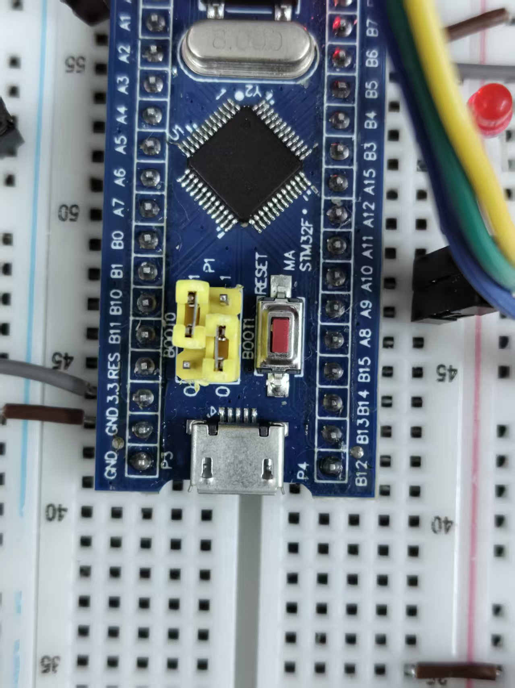
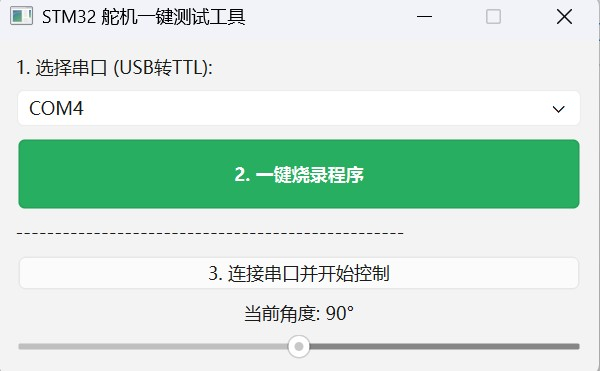

# STM32 舵机一键测试工具

这是一个基于 **STM32F103C8T6** 开发的舵机测试方案。项目包含底层固件（C 语言）和上位机可视化界面（Python/PyQt6），支持一键固件烧录与实时角度控制。

##  项目特点

- **可视化控制**：通过 Python 上位机拖动滑块即可实时调节舵机角度（0°-180°）。
- **一键烧录**：集成 `STM32CubeProgrammer` 命令行工具，无需打开代码即可完成固件更新。
- **免环境运行**：最终成品为单文件 `舵机测试.exe`，无需安装 Python 或开发环境。

------
## 项目拉取说明
在git bash中输入`git clone https://github.com/confusing-gjy/servo_detection.git`来拉取仓库
不要直接在github上下载压缩包

## 硬件连接说明

为了确保系统正常运行，请按以下要求连接硬件：

### 1. 舵机连接

- **信号线 (黄/橙)**：连接 STM32 的 **PA0** (TIM2_CH1) 引脚。
- **电源线 (红)**：连接 5V 电源。
- **地线 (黑/棕)**：连接 GND（必须与单片机共地）。

### 2. 串口连接 (USB 转 TTL)

- **TX (TTL)** $\rightarrow$ **PA10 (RX1)** 
- **RX (TTL)** $\rightarrow$ **PA9 (TX1)** 
- **GND** $\rightarrow$ **GND** (必须共地) 

------

## 操作指南

### 第一步：烧录固件（下载模式）

1. **切换跳线**：将单片机上的 **BOOT0 拨至 3.3V (1)** 位置。如图

   

2. **激活模式**：点击软件上的“一键烧录”按钮前，必须先按一下单片机上的物理 **Reset（复位）键**。

3. **软件执行**：打开`ServoControl`文件夹中`dist`文件下的 `舵机测试.exe` ，选择对应的 COM 端口，点击 **“一键烧录程序”**。烧录过程需要一定时间，期间请耐心等待，直到提示烧录成功

   

### 第二步：测试控制（运行模式）

1. **切换跳线**：烧录成功后，将 **BOOT0 拨回 GND (0)** 位置。

   

2. **重启系统**：再次按一下 **Reset 键** 或重新插拔 USB。

3. **建立连接**：在软件中点击 **“连接串口并控制”**。

4. **角度调节**：拖动滑块，舵机即可在 0° 到 180° 之间旋转。

------

